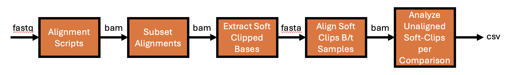

# EV Integration Analysis (ERP167546)

This repository contains alignment scripts, metadata, and soft-clip comparison tools associated with the ENA study accession **ERP167546**, focused on extracellular vesicle (EV) interactions and viral responses in BMDCs and HEK293T cells.

**Figure 1. Workflow for EV Integration Analysis in LydenLab Repository.**  


Caption: This flow chart outlines the processing steps used in the EV integration pipeline. Starting from combined FASTQ files, reads are aligned to reference genomes or viral sequences using **Alignment Scripts**. BAM files are then subset to genes of interest (**Subset Alignments**). Soft-clipped bases are extracted from these BAMs (**Extract Soft Clipped Bases**) and aligned between experimental and control samples (**Align Soft Clips B/t Samples**). Finally, the percentage of unique soft-clipped reads per comparison is calculated and exported as CSV results (**Analyze % of Unique Soft-Clips per Comparison**).

## 🔬 Experimental Overview

This dataset involves multiple experimental conditions across different cell types and treatment protocols. The overall ENA study accession is **ERP167546**.

### BMDCs Experiments [pod5]

| Treatment             | Submission Date | Run Accessions                          | Notes                             |
|----------------------|------------------|-----------------------------------------|-----------------------------------|
| ATEV (EV-treated)     | Jan 8th, 2025    | ERR14106287, ERR14106288                | Two technical replicate flowcells |
| PBS (control)         | Jan 24th, 2025   | ERR14208048, ERR14208049, ERR14208050   | Three technical replicate flowcells |
| Virus Ref 1           | Feb 16th, 2025   | ERR14376133, ERR14376134                | Two technical replicate flowcells |
| Virus Ref 2           | Jul 9, 2025   | ERR15277392                | One technical replicate flowcells |

### 293T Samples [pod5]

| Run Accession | Sample Description                |
|---------------|-----------------------------------|
| ERR15277390   | HEK293T treated with PBS          |
| ERR15277391   | HEK293T treated with virus_ref_3  |

### BMDCs and 293T Samples [fastq]

| Sample Description                  | Run Accession | File Name                                                     | Notes                             | Size (bytes)   |
|--------------------------------------|---------------|----------------------------------------------------------------|------------------------------------|----------------|
| HEK293T treated with virus_ref_3     | ERR15435818   | PAY43290_combined_Virus_293T.fastq.gz                          | Combined FASTQ                     | 100,889,391,034|
| HEK293T treated with PBS             | ERR15435817   | PAY39146_combined_PBS_293T.fastq.gz                            | Combined FASTQ                     | 72,064,431,107 |
| PBS-treated BMDM                     | ERR15435816   | combined_PBS_BMDM.fastq.gz                                     | Combined FASTQ                     | 144,627,113,608|
| EV-treated BMDM                      | ERR15435815   | combined_EV_BMDM.fastq.gz                                      | Combined FASTQ                     | 62,741,773,191 |
| Virus-treated BMDM (Virus Ref 1)     | ERR15435814   | combined_Virus_Treated_1_BMDM.fastq.gz                         | Combined FASTQ                     | 145,518,985,365|
| Virus-treated BMDM (Virus Ref 2)     | ERR15435813   | PAY42928_pass_combined_Virus_Treated_2_BMDM.fastq.gz           | Combined FASTQ                     | 114,042,846,728|

---

## 📁 Repository Structure

```bash
ev-integration/
├── FIGURE_S25B/                        # key scripts for figure generation
├── FIGURE_S25C/
├── LydenLab_alignment_scripts/        # SBATCH scripts for alignment to various references
├── LydenLab_pairwise_bam_comparisons/ # Scripts to compare soft-clipped reads across BAMs
├── LydenLab_subset_alignment_scripts/ # Gene Subset-specific alignment jobs
├── metadata/                          # Submission/sample metadata / spreadsheets for all samples
├── references/                        # Contains viral reference sequences (LydenLab_Virus_Ref 1,2,3)
```

### Methods & Versioning

DNA Libraries were prepared with the SQK-LSK114 gDNA Ligation Sequencing Kit and sequenced with FLO-PRO114M flow cells (Oxford Nanopore Technologies). Real-time basecalled reads were produced with MinKNOW Version 24.06.15 and aligned separately with minimap2 v2.28 to the UCSC hg38 reference genome (10.1101/gr.159624.113), UCSC mm10 reference genome and viral vector (LentiGuide-GFP.fa for BMDCs, Addgene# 200961 for the 293T cells). Selected gene coordinates were queried the UCSC genome browser (https://genome.ucsc.edu/cgi-bin/hgGateway). Reads associated with these genes were extracted with samtools v1.21. pysam v0.22.1 was used to extract left and right soft-clipped ends. Soft-clipped ends greater than or equal to 50 bp from either ATEVs or viral vector conditions were aligned to soft-clipped ends from the PBS condition with minimap2 v2.28. The ratio between the number of unaligned soft-clipped ends and total DNA count was then calculated to score gene integration.

### Repository Contents & Key Resources

The repository is organized into directories for figure generation, alignment scripts, BAM comparison utilities, subset alignments, metadata, and references. Below is a detailed breakdown.

---

#### `FIGURE_S25B/`  
Contains data files and scripts used to generate Supplementary Figure S25B.

- **LydenLab_EV_comparison_summary_softclip_unaligned_fraction.csv**  
  CSV summarizing the fraction of unaligned soft-clipped reads for EV vs. PBS comparisons across targeted genes.

---

#### `FIGURE_S25C/`  
Contains plotting scripts used to generate Supplementary Figure S25C.

- **plot_softclip_ecdf.py**  
  Python script to generate ECDF (Empirical Cumulative Distribution Function) plots of soft-clip read lengths or qualities across experimental conditions.

---

#### `gene_pairwise_bam_comparisons/`  
Holds outputs from gene-specific pairwise BAM comparisons. Each subfolder corresponds to a gene of interest, containing intermediate and final results.

- **Example subfolder: `combined_EV_BMDM_vs_combined_PBS_BMDM/H2-Aa/`**  
  - `PBS.softclips.fasta` — FASTA of soft-clipped PBS reads for the gene.  
  - `PBS.softclips.mmi` — Minimap2 index for PBS softclips.  
  - `pbs.subsampled.bam` / `.bai` — Subsampled PBS BAM for this gene.  
  - `virus.subsampled.bam` / `.bai` — Subsampled BAM for EV/virus condition.  
  - `Virus_vs_PBS.sam` — Alignment of virus-treated softclips to PBS softclips.  
  - `softclip_summary.csv` — Summary of match/mismatch and alignment metrics.  
  - `softclip_combined_EV_BMDM_vs_combined_PBS_BMDM_H2-Aa.out` — Raw minimap2 alignment output for the comparison.

- **Gene targets include**:  
  `H2-Aa`, `H2-Ab1`, `H2-DMb1`, `H2-Eb2`, `H2-K1`, `Tap1`  
  for mouse MHC genes, with analogous human HLA/TAP targets in other folders.

---

#### `gene_subsets_bam_bai/`  
Contains sorted and indexed BAM files for targeted alignments to specific genes. Filenames indicate:  

- **Sample Name** (e.g., `combined_EV_BMDM`)  
- **Species** (`human` or `mouse`)  
- **Gene** (e.g., `HLA-B`, `H2-Aa`)  

Example:  
- `combined_EV_BMDM.all.sorted_mouse_H2-Aa.bam`  
- `combined_EV_BMDM.all.sorted_mouse_H2-Aa.bam.bai`  

These files allow focused analysis on loci of interest without processing whole-genome BAMs.

---

#### `LydenLab_alignment_scripts/`  
Pre-written SLURM `sbatch` scripts for aligning combined sample FASTQs against multiple references using minimap2.

- **Naming convention**:  
  `align_<sample>_<reference>.sbatch`  
  where `<reference>` is `hg38`, `mm10`, or one of the three viral references (`virus_ref_1`, `virus_ref_2`, `virus_ref_3`).

- **Example scripts**:  
  - `align_combined_EV_BMDM_hg38.sbatch` — Align EV-treated BMDM to human genome.  
  - `align_PAY43290_combined_Virus_293T_virus_ref_3.sbatch` — Align HEK293T virus sample to virus reference 3.

These scripts produce sorted, indexed BAMs along with alignment statistics.

---

#### `LydenLab_pairwise_bam_comparisons/`  
Scripts for pairwise BAM analysis focused on **soft-clipped read behavior**.

- `compare_softclips_bam_pair.py` — Compares soft-clip retention and re-alignment between virus-treated (or EV-treated) reads and PBS controls.  
- `summarize_softclip_unaligned_fraction.py` — Summarizes the fraction of unaligned reads for each comparison.  
- `run_softclip_comparisons_sequential_V2.sh` — Batch runner for multiple pairwise comparisons.

---

#### `LydenLab_subset_alignment_scripts/`  
Scripts to align only reads mapping to selected gene subsets.

- **subset_alignments_by_gene_V2.sh** — Extracts reads for a set of target genes from full BAMs, then aligns them to relevant references.

---

#### `metadata/`  
Contains ENA submission and sample metadata files for all experiments.

- **Run Submission Files**:  
  - `LydenLab_Run_Submission_BMDCs_EV_Treatment.tsv` — Accession IDs and submission details for BMDC EV-treated samples.  
  - `LydenLab_Run_Submission_fastq.tsv` — Metadata for combined FASTQ uploads.  

- **Sample Metadata Files**:  
  - `LydenLab_Sample_Metadata_BMDCs_PBS_Treatment.tsv` — PBS control sample details.  
  - `LydenLab_Sample_Metadata_Virus_Control_2_3.tsv` — Virus control (references 2 & 3) sample info.

---

#### `references/`  
Contains reference FASTA files for viral vectors.

- **LydenLab_Virus_Ref/** — Three separate viral reference genomes:  
  - `virus_ref_1.fa`  
  - `virus_ref_2.fa`  
  - `virus_ref_3.fa`  

These are used for targeted alignments and soft-clip mapping.

---

### Analysis Workflow Overview

1. **Align combined FASTQs** to the chosen reference genome or viral sequence using scripts in `LydenLab_alignment_scripts/`.
2. **Subset alignments** by gene (if needed) using `LydenLab_subset_alignment_scripts/`.
3. **Perform pairwise BAM comparisons** with PBS controls using `LydenLab_pairwise_bam_comparisons/`.
4. **Generate summaries and figures** using `FIGURE_S25B/` and `FIGURE_S25C/` scripts.
5. **Interpret results** using metadata in `metadata/` for experimental context.

---

## 📚 Citation

If you use this repository or data in your work, please cite the originating study linked to **ERP167546**.

---

For questions, contact **Theo Nelson** (thn4005@med.cornell.edu).
